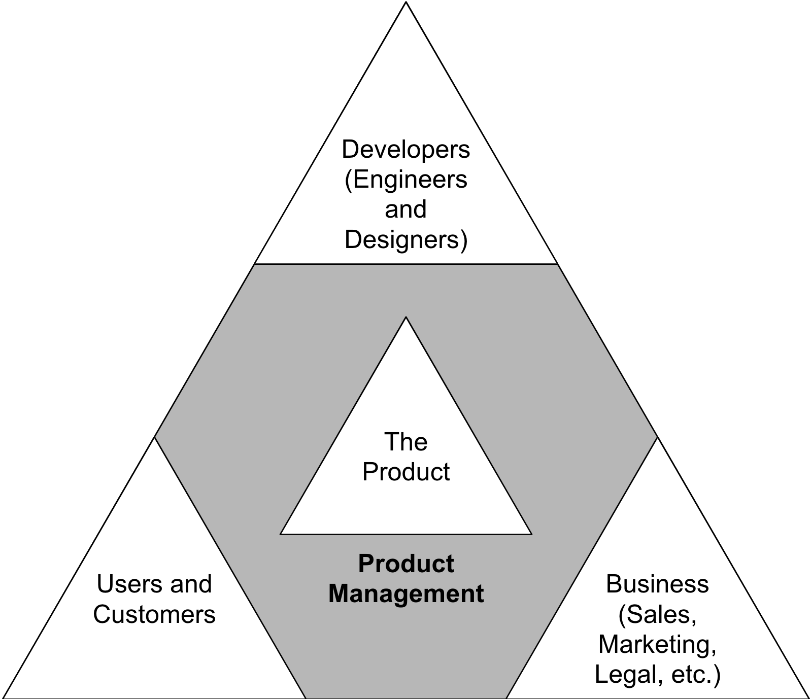
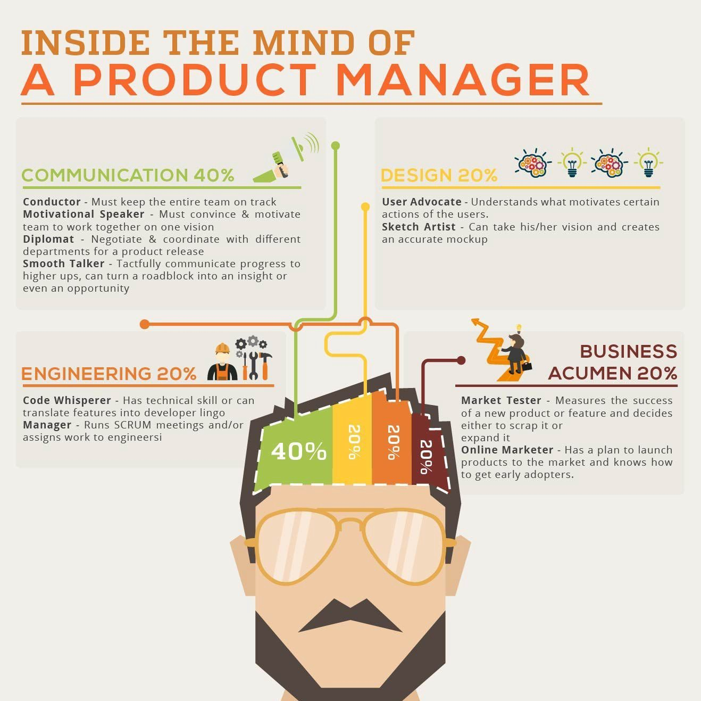

# Product Manager {-}

## Who is a Product Manager? {-}

> A product manager connects business strategy, design knowledge, and customer needs in order to develop a product that is relevant, feasible, and valuable. PMs are focused on optimizing a product to achieve the business goals and user necessities while maximizing return on investment.

> They are the overseers of a company’s products and the technological innovation behind them, and the stewards of that innovation’s role in meeting the customers’ needs in the marketplace.

{width=90%}

## What Do They Do? {-}

* Identify a problem - Product managers assess the market and suggest ways to leverage their company’s resources to create a product that will solve a problem for customers.

* Interview prospective customers - This enables product managers to get a feel for how the potential software or hardware product could be used and how much of a market exists for the product.

* Develop a proposal for the product - Product managers work closely with technologists to scope the technical parameters and determine what products and features will best align with the company’s business strategy. A great product that customers will love (and buy!) is said to have great product-market fit.

* Let the technical people build the tech - Product managers at this stage help things move along smoothly and check in to ensure the process stays on track.

* Ask thoughtful questions throughout. Keep the business strategy top of mind for the company. 

* Make sure the product works. Product managers constantly measure, test, and validate their product with their customers—to make sure that what the team has built meets customer needs as well as they had hoped. 

* Launch the product. Product managers work closely with the company’s marketing team to reach the right customers. 

## Skills Required for These Roles {-}

{width=100%}

### Communication Skills: {-} 
> Product managers are the product champions and are responsible for guiding product ideas from start to finish.They should be able to communicate with different stakeholders (e.g., customers, product team members) in order to make sure they understand how their decisions will affect the product or business strategy. Communication skills help a product manager establish credibility, listen to their product team, and create a shared understanding of the product.

### Technical Expertise: {-}
> Product managers need to be able to understand product design, engineering, and coding.This means that they should know the difference between UX/UI designers, product engineers, and product developers and how each of their skills is fundamental in designing an outstanding product.Basic technical expertise is also important for understanding what problem a product solves and making sure the product is properly built and tested.

### Business Skills: {-} 
> Product managers must be able to use data-driven decision-making and understand the business side of product development.Product managers need these deep business skills because they have less time for traditional “product management” tasks like product planning or product design.The product manager role will evolve with product development to be more business-focused.

### Research Abilities: {-} 
> Product managers need product management skills and deep business knowledge, but they also must have a strong understanding of the customer.The product manager will then be able to apply their product development skills strategically with data-driven decision-making for an outstanding product that meets market needs in 2022. It is important for product managers to keep up with trends, product management techniques, and new product development strategies. Product managers should be able to understand the ever-changing customer needs, think strategically about diversifying or evolving products/services that already exist but are not meeting current market needs.

### Strategic Thinking Skills: {-}
> Product managers must be able to think about product strategy past what is simply on the product roadmap, and this means being able to anticipate possible hurdles or problems. This includes thinking of ways around a problem that have been tried before in order to come up with something new and innovative for their product.

### Prioritization Skills: {-}
> Product managers need to be able to prioritize product features, requirements, and tasks in order of importance. This means that product managers must know which product feature will have the most impact on their customers or potential customers.

## Salary with Years of Experience: {-}

* Associate product manager  - $80,000–$100,000 (0-3 years of experience)			
* Product manager	- $110,000–$140,000 (4-8 years of experience)			
* Senior product manager	- $135,000–$180,000 (9+ years of experience)			
* Director of product management	-  $150,000–$184,000 (supervises 3-5 PM)			
* VP of product management	-  $190,000–$230,000 (supervises 9-12 PM)			
* Chief product officer (CPO)	-  $210,000–$275,000 (supervises at company level)

## Admission Timeline Based on Company Type {-}

{width=90%}

## Components of the Product Management Interview Process {-}

### Product Questions {-}

Questions about product are possibly the most common in PM interviews, which shouldn’t come as a surprise! Even if you’re not overly technical, the best way to prepare is to thoroughly read through the description of the role you’re applying for, and try to find some resources (dev blogs, press releases etc) on the products you’ll be working with. Being able to demonstrate your previous experience or Product Management education will be invaluable here.

* How would you prioritize resources when you have two important things to do but can’t do them both?
* Describe a scenario which required you to say no to an idea or project.
* How do you decide what and what not to build?
* What is a product you currently use every day, why and how would you improve it?
* There is a data point that indicates that there are more Uber drop-offs at the airport than pick-ups from the airport. Why is this the case and what would you do   within the product to change that?
* How would you improve the functionality 10x of what it is now?
 

### Technical Questions {-}

Very, rarely will you be asked any overly technical questions in a Product Manager interview. Unless you’re applying to be a Technical Product Manager, or you’re a few rounds in for a specific PM role which requires a higher tech skill set. In general, technical questions in PM interviews are designed to see how well you’d work with engineers, and to test your familiarity with the tech the company is working with.

* Our engineering teams are pretty used to employing x methodologies. What is your opinion of them? Have you used them in the past?
* What is the importance of engineers and technical teams as stakeholders? How do you integrate them into the overall product vision?
* Can you provide an example where a technical solution you or your team designed became a commercial product?
* How do you ensure that market-oriented teams fully understand technical challenges?
* When are Bayesian methods more appropriate than “Artificial Intelligence” techniques for predictive analytics?

 
### Analytical Questions {-}

A Product Manager has to come ready with an analytical mind in order to succeed. Some companies may ask you questions designed to reveal how you think, and how you’d approach a problem. The key when being asked these questions is not to rush yourself.

*  many people are currently online in Europe?
* How many windows are in New York City?
* How many iPads are sold in the USA every year?
* How much money is spent in the USA per year on GAS?
* How would you go about finding out the number of red cars in China?

###  Product Management Questions {-}
Product Management is different at every company, and every person approaches their craft differently. Gauging your understanding of the role helps the company to determine your culture fit for the PM team. If you walk in with a ‘CEO of the Product‘ mentality, and they’re looking for someone more humble and collaborative, you run the risk of being turned away. So just be yourself and be honest. If you’re the right PM for the team, they’ll see that straight away!

* What aspects of Product Management do you find the most exciting?
* Tell me about a time when you had to build or motivate a team.
* What do you think a day to day would be like for a Product Manager?
* How do you think Product Managers interact with engineers?
* How would you explain Product Management to a 5-year-old?

### Behavioral Questions {-} 

Seeing a list of skills is all well and good, but an interview gives a company a chance to gauge how you behave day to day. They want to know that you work well in high-pressure environments, that you’re able to influence without authority, and manage stakeholder expectations. If you’re asked about a situation you haven’t yet faced, instead of saying “I haven’t done that yet,” talk about how you would face it in future.

* Tell me about a challenging issue or challenge you took on
* Tell me about how you interact with customers/users?
* Talk about how you overcame product failures/challenges or poor feedback.
* Tell me about a time you had to influence someone.
* Tell me about a mistake you made and how you handled it.

## List of Important Books for the Interview {-}

* https://www.amazon.com/Cracking-PM-Interview-Product-Technology/dp/0984782818
* https://www.amazon.com/dp/0578740583/
* https://www.amazon.com/Product-Manager-Interview-Questions-Answers/dp/0998120448
* https://www.amazon.com/Decode-Conquer-4th-Lewis-Lin/dp/B09Q8WN1KS/

