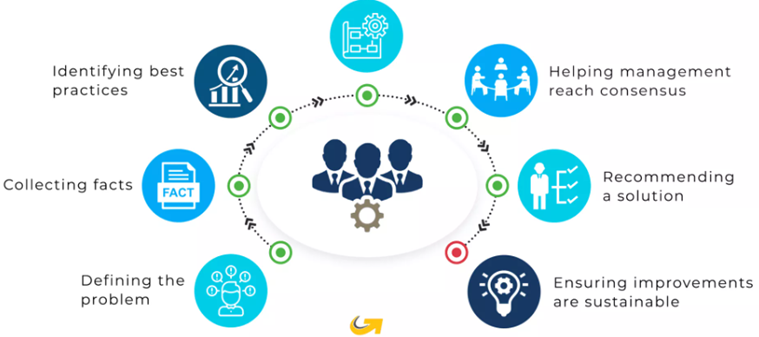
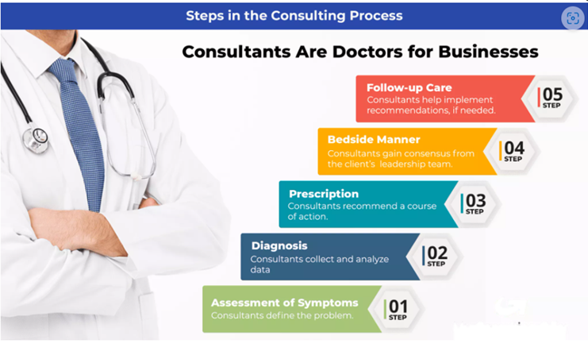
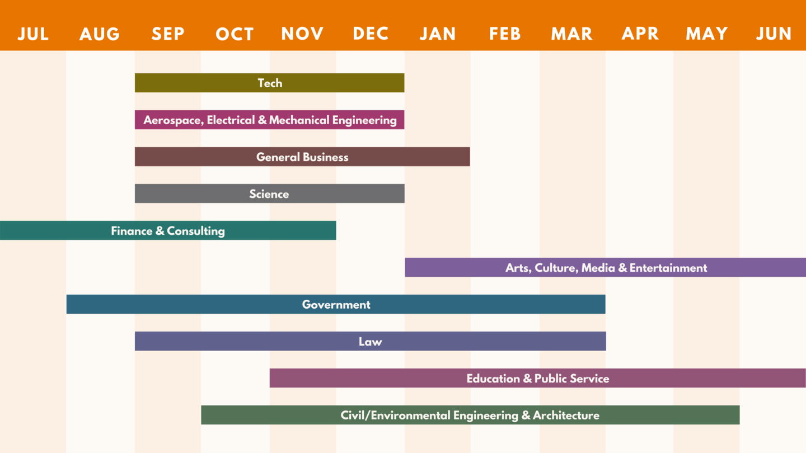

# Consultant {-}

## Who is a Consultant? {-}
> Consultants, as “doctors” for businesses – bring in to diagnose the root cause of an issue, and then prescribe and implement treatments with the patient’s consent. They provide business advice on various topics including marketing, information technology, operational improvement, and corporate strategy.
> Consultants, are strong problem-solvers with business acumen. They can lead the client through the process of completing a data-based analysis of their business problem and evaluating alternative courses of action. They can also leverage their firm’s collective knowledge and experience to bring extensive industry and functional knowledge to bear to solve the problem. 

{width=90%}

## What Do They Do? {-}
> In short, consultants solve complex business problems using their expertise and knowledge in specific industries or functions. This could range from cutting costs, to growing sales, or evaluating a new market the client is considering entering.
> Consultant usually follow the following steps to solve practical problems for companies:

* Assessment of symptoms: A client knows they’ve got a business problem (such as declining revenue or a new competitor in their market. They turn to a consultant for help getting to the root of the problem as a sick patient would turn to a doctor. 

* Diagnosis: The consultant will assess the client’s business performance, taking into account similar problems they’ve seen at clients in the past, like a doctor would check their patient’s symptoms against known illnesses.
* Prescription: The consultant will recommend a course of action to improve revenues or meet a competitive threat much like a doctor would tell their patient what’s wrong with them and prescribe medicine or recommend a medical procedure.
* Bedside manner: The consultant has the experience to steer a client to the right course of action as a doctor would advise a nervous patient.
* Follow-up care: The consultant will provide the client with a step-by-step process that will improve their business results much like a doctor would provide a patient with the steps necessary to regain their health.

{width=90%}

## Skills Required for this Role {-}
> The skills required to be a professional consultant will vary depending on the industry and the consulting role, but the core skills are probably the following

### Creative Thinking {-} 
> Creativity is a top priority in fields like art, writing, graphic design and food. Other industries may not seem like they would prioritize creative thinking, but the definition is broader than just producing art. Creative thinking gives people ideas that go beyond the standard and normally accepted ways of approaching the business of the industry. It encourages brainstorming and listening to ideas from all kinds of people.

### Thinking Conceptually and Practically {-}  
> The client requires the consultant to give them recommendations that are not only in line with the company's business processes and industry norms, but also those that can be implemented and can add value to the company's business.Conceptual thinking suggests you are visionary and innovative. You may have a strong sense of intuition, or the ability to coax ideas from people who have a difficult time finding the words for abstract concepts. You might ask provocative questions in a group brainstorming session to help others think conceptually and formulate inspirational touchstones for the company to believe in.

### Fast-Learning {-} 
> The clients that consultants deal with during their career are from different industries and their problems and the external or internal environment they are in will be different. A professional consultant needs to be able to quickly grasp all the information about the company's industry, the company's business and quickly find out the current core problems of the company.

### Problem-Solving {-} 
> You may be called in to consult when permanent employees need additional guidance or expertise. Your role may often involve problem-solving, possibly without a great deal of advance information on issues you might be presented with. Depending on the type of consultant you are, you may be responsible for conflict resolution among employees, assisting in the creation of a business plan for a self-employed man or woman, analyzing bookkeeping practices of a company or providing training in a variety of fields.
> Your ability to listen carefully to the concerns the employees present to you and react quickly and thoughtfully to help propose solutions may be among the most valuable skills you can possess.

### Communicating Clearly and Empathetically {-} 
> Once you have some solutions for a company’s problems, the recipients should value your ability to communicate those answers clearly, concisely and with empathy. You show empathy by demonstrating a willingness to hear how a problem is affecting the employees personally, and not just the bottom line from a financial or production standpoint. 
For example, if your consultancy is focused on improving efficiency in a restaurant, the cooks, servers, hostesses and kitchen workers will be the ones to carry out your suggestions. When you can show kindness and understanding while clearly outlining the changes those workers need to make, they are more likely to respond favorably and accept the work they should do.

### Collaboration with All Job Levels {-} 
> As a consultant, you may be hired by a company’s board, senior management or a specific department within a company. It will be useful to have a sense of confidence when working with both stakeholders and employees who will carry out a plan. Developing poise, politeness, friendliness, excellent listening skills and public speaking skills will serve you well in any circumstance.

### Organization and Time Management {-} 
> When a company hires a consultant to help with a restructuring or a concern, their time will be just as valuable as yours. Meetings are likely an inevitable part of the process, but you can show respect for their time by conducting meetings with a sense of brevity and efficiency. You could work with people in advance to prepare an agenda and be polite but firm in your attempts to keep a meeting on task.
You could suggest limiting the meetings to necessary employees only, especially for preliminary work where you define the scope of your consultancy project. Prepare for meetings well in advance and have any electronic presentations and documents easily accessible so you can give your suggestions with confidence and avoid delays.

## Salary with Years of Experience: {-}

Based on the Consultant Salary Guide, the latest information on management consulting salaries for 2022, Consultant salaries will vary by position and experience.

**Position**             | Salary             | Bonus
-------------------------| -------------------| ---------------
**Entry-Level**          | $83,5000           | $5,000-$15,000
**MBA Hires**            | $149,000           | $25,000-$37,000
**Project Leader**       | $175,000           | $80,000-$110,000
**Shareholder/Partner**  | $570,000-$1,000,000| $300,000+

## Recruitment Process in Consulting {-}

{width=90%}
> Starting with the 2023 fall recruiting, Consulting Giants, such as MBB, have moved up their fall recruiting round 1 deadline from September in previous years to July. So we, as candidates, must start preparing in advance.\
Usually, when you submit an online application for a position in the consulting, you will receive an online assessment if your resume passes the initial screening, but some companies issue OTs to all candidates. After that, there will be one round of HR Pre-Talk and two or three rounds of case interview. If you pass all of them, you will receive an offer!

> 2023/2022 Consulting Company-North American Campus Recruiting Application and Interview Schedule (not exhausted):

### McKinsey-2023: {-}
* Online Application deadlines:
  * Round 1: Jul. 7th
  * Round 2: Aug. 11th
* Expected Interview in September
* Offer release in October

### BCG-2023: {-}
* Round 1: Jul. 14th	
* Online assessment and Interview in August and September
* Offer release in October
* Round 2: Aug. 23th 
* Online assessment and Interview in September
* Offer release in October or November

### Bain-2023: {-}
* Round 1: Jul. 11th	
* Round 2: Aug. 8th 
* Round 3: Sept. 15th 
* Online assessment and Interview is rolling
* Offer release in October to November

### Kearney-2023: {-}
* Application deadline: Aug. 23th
* Pre-talk and Interview: September to October
* Offer release in November

### PwC Strategy&-2022: {-}
* Application deadline：Sept. 21th
* Online assessment will be sent automatically once you submit
* Pre-talk and Interview: October to November
* Offer release in November to December

### OC&C Strategy-2022: {-}
* Application deadline: Oct. 18th
* Pre-talk and Interview: October to December
* Offer release expected before January in next year

## Timeline in Consulting Preparation: {-}
>Since the interview timeline is very tight, we recommend that you follow the principle of "the earlier the better" during your preparation, the following timeline is as reference: 

### May:{-}
* Promote your resume
* Research on your dream company
* Start networking

### June: {-}
* Behavioral Questions 
* Get to know the background of Case Interview
* Mini-Case Practice

### July: {-}
* Round 1st or 2nd application deadline
* Online test Preparation
* General Case Preparation
* Mock Interview

### August - September：{-}
* Most application deadline
* Mock Interview
* Interview with some companies (if have)
* Networking with 2nd/3rd choices

### October: {-}
* Offer & Offer call! (Maybe)
* Mock Interview
* Interview with some companies

### November – December: {-}
* Final Rounds (most companies)
* Offers

### December – April Next Year: {-}
* Network with future colleagues/business insights

## Components of the Consultant Interview Process {-}
>Case interviews take very similar formats across the various consultancies where they are used. Before landing an offer at McKinsey, Bain, BCG or any similar firm, you will have to complete between four and six case interviews, divided into two rounds, with each interview lasting approximately 50-60 minutes. Here is the typical case interview timeline:\

### Interview Timeline {-}
* First 15-30 minutes: Fit Interview, assessing your motivation to be a consultant in that specific firm and your leadership and teamwork traits. Learn more about the fit interview in our article here.
* Next 30-40 minutes: Case Interview
* Last 5 minutes: Fit Interview, again. This time it’s about your questions for the interviewer.

### What Skills Do Interviewers Want to See from Your Interviews? {-}
* PROBING MIND: Showing intellectual curiosity by asking relevant and insightful questions that show show critical thinking and proactive nature
* STRUCTURE: Structuring means creating a framework, i.e. a series of clear consecutive steps in order to get to a solution to the problem. The focus of case interview frameworks (and of the whole case in general) is not on reaching solution themselves, but rather on how to get there.
* PROBLEM SOLVING: You’ll be tested on your ability in identifying problems and drivers, isolating causes and effects, demonstrating creativity, and prioritizing issues.
* NUMERICAL AGILITY: In case interviews, you are expected to be quick and confident with (precise and approximated) numbers.
* COMMUNICATION: As in real consulting work, coming up with the best ideas in a consulting case interview is necessary, but not enough: you must be able to turn your answer into a compelling recommendation. Otherwise, your days and nights of hard work spent on case interview prep have been totally wasted.

## Resources for Interview Preparation {-}

* CDO staffs: John Goebel – general career goal/resume/cover letter/networking/behavioral interview

* [Ross recruit](https://michiganross.12twenty.com/dashboard): Career fairs and events

* [Handshake](https://umich.joinhandshake.com/stu): Interview prep/career events (Career fairs on handshake are only for undergrads)  

* Case book: [Case in Point](https://www.amazon.com/Case-Point-11-Interview-Preparation/dp/0986370762) 
* Online courses: [Victor Cheng’s case prep videos](https://www.youtube.com/user/caseinterview)

* Case partners: [Umich students case partner sign-up sheet](https://docs.google.com/spreadsheets/d/1OOivoyCFCxn9pPRAnX6Q3i0j222d3IFuRYg1YB57SQA/edit#gid=0)

* Company websites: Coffee chat and recruiting events

* LinkedIn: [Ross alumni group](https://www.linkedin.com/groups/603/), [Consulting group](https://www.linkedin.com/groups/1968923/), [MCommunity](https://mcommunity.umich.edu/) for finding alumni emails
